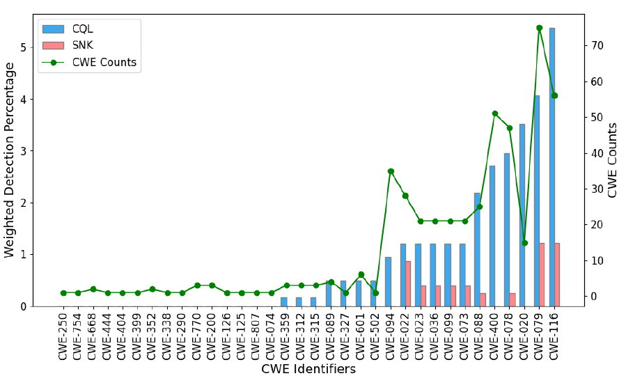
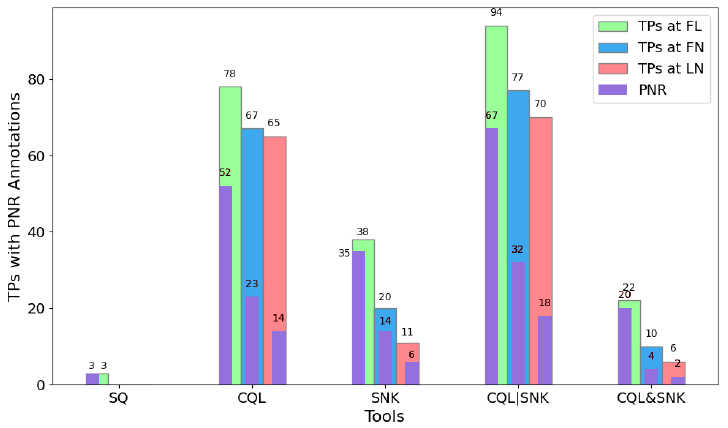
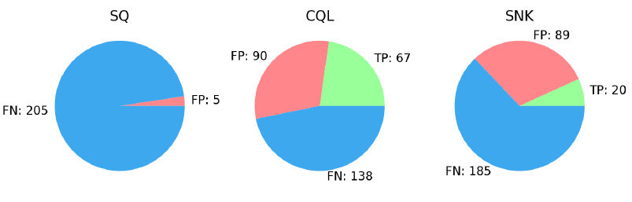
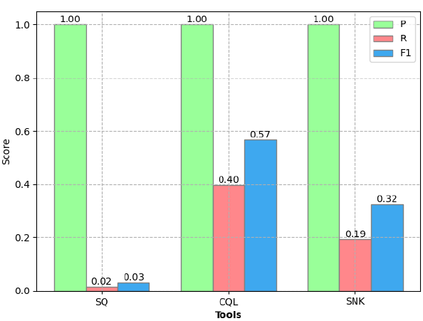

# Data-Visualization

Data-Visualization is a Python-based repository for creating different types of visualizations to analyze and present data effectively. It leverages popular libraries like Matplotlib, Seaborn, and Pandas.

**Examples**

